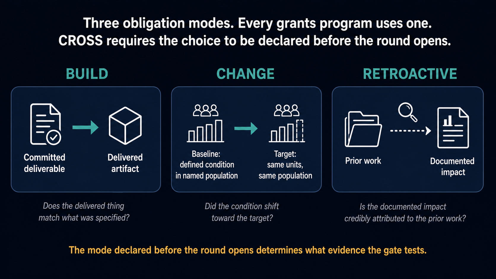
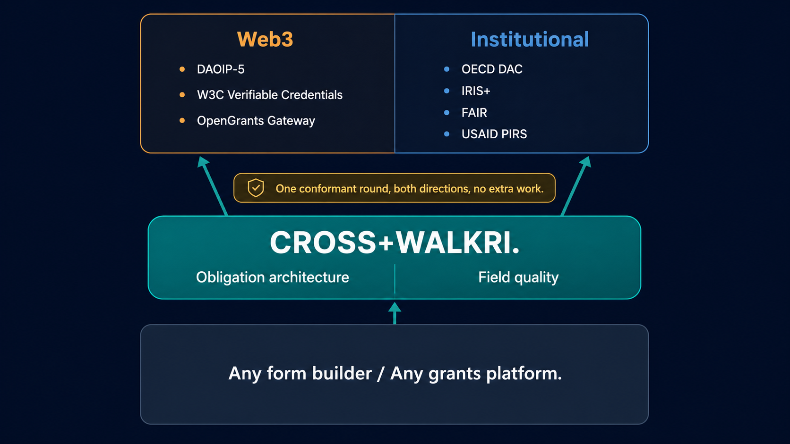

# CROSS: Common Reporting Outcome Standards Schema

Version 0.4.7 | 2026-05-19 | CC0

**Two standards. One problem.**

Most grant programs never write down what grantees must prove to get paid. They have eligibility criteria. They do not have an obligation architecture. Reviewers fill the gap with their own judgment. The data this produces looks structured, but it is not.

CROSS fixes that. It specifies what must be demonstrated at each payment gate, declared before any applicant sees the form, in one of three obligation modes: build something specific, produce a measurable change in the world, or recognize work already done. Every grants program answers these questions implicitly every round. CROSS makes the answers explicit, documented, and auditable.

**CROSS is the first standard that has ever required this decision to be written down before the round opens.**

---

## Two failure modes. One fix.

Comparative examination of grant programs across web3, open source, and institutional contexts surfaces a consistent pattern. The failure locates itself differently depending on the type of program.

In web3 grant programs, the hard part is consistently upstream: at the point of claim specification. Applicants default to aspiration language, naming what they are trying to achieve rather than conditions that can be independently measured. Without a specific measurable baseline there is no measurement instrument, no FROM state, no outcome. Funding decisions are made on the basis of who sounds most plausible, not who has specified what they will actually produce.

In governmental and institutional programs, the hard part tends to locate itself downstream: at reporting and verification. Applications are detailed. Reports arrive on schedule. But the reports describe activity, not outcomes. Grantees learn to write good reports rather than produce measurable results. The evidentiary chain between award and impact exists on paper but not in practice.

CROSS was designed to be portable across both failure modes. It separates the evidentiary structure from the program design and makes both configurable. Programs configure where the evidentiary pressure falls. The gate architecture installs it at the front for programs where baseline specificity is the failure mode, and at the back for programs where outcome verification is the failure mode.

---

## The correct order of operations

Across the 95+ frameworks documented in this corpus, from the Hewlett Foundation's evaluation approach to USAID PIRS to OECD DAC criteria, a consistent pattern emerges: data quality problems in grant programs trace to specification decisions made before the first application was submitted. Round design is where funding governance either happens with intention or happens by default. Application design and field specification are where that governance meets the applicant. The quality of decisions made at these two stages determines whether the data a program produces can be compared, aggregated, trusted, or used.

The obligation architecture that serious grantmakers developed across international development, philanthropy, public health, research funding, and environmental finance is not bureaucratic preference. It is the correct order of operations: specify what grantees must demonstrate before anyone applies; collect evidence against that specification; evaluate delivery before funds continue; carry what you learned into the next round. Every serious grants institution outside the Web3 ecosystem arrived at this sequence through experience with the consequences of inverting it.

Web3 grants programs inverted the order by inheriting a founding template that was designed for a different problem. The Moloch DAO ragequit addressed pre-disbursement pool governance among known contributors. Quadratic funding addressed allocation optimality. Neither addressed the operational sequence that makes a grants program learn over time. The result is a sector that has disbursed over a billion dollars under an architecture that was never designed to track what those disbursements produced, reproducing at scale the single failure mode that every institutional grantmaker developed its back-end accountability infrastructure to prevent.

CROSS is an architecture for putting the order back. It does not add bureaucracy to a system that was working. It restores the sequence that was missing from the founding template and that every other serious grants institution uses as its operational foundation.

---

## What CROSS specifies

**Three obligation modes** correspond to three fundamentally different accountability structures.

Build obligation applies where the deliverable is a specific artifact. Gate tests confirm whether the delivered thing matches what was specified. This is the right mode for software tools, research reports, infrastructure deployments, and any work where completion has a clear binary test.

Change obligation applies where the goal is a measurable shift in an external condition. The entry specification gate requires a baseline value, a target in the same units, a defined population, a named data source, and a stated mechanism connecting the intervention to the anticipated shift. This prevents aspiration language from entering the record because a grantee cannot name a FROM state without having diagnosed the problem before designing the solution.

Retroactive obligation applies where work is already done. Gate tests confirm whether the documented impact is credibly attributed to the prior activity. This is the right mode for retrospective public goods funding, recognition of past contributions, and programs where the work precedes the funding decision.

**A four-gate sequence** governs each funding release: entry specification before any funds move, one or more milestone gates during delivery, a completion gate at close, and an optional continuation gate determining whether a grantee enters subsequent rounds. Programs configure which gates apply and at what rigor tier, and publish that configuration before any application opens.

**Eight independent obligation dimensions** can be configured independently within a single round: outcome specificity, evidence quality tier, attribution claim strength, financial transparency scope, organizational disclosure depth, institutional framework alignment, portfolio position declaration, and causality stance. The dimensions do not collapse into a single score because the failure modes they address are structurally distinct.

**Organizational identity** requires five declared fields: legal or registered name, primary operating jurisdiction, primary contact, governance structure type, and organizational history. Version 0.3.8 adds Field 6: an on-chain identity anchor, recording the grantee's verifiable on-chain identifier and linking the declaration to on-chain activity records without requiring that linkage as a condition of participation.

**Two funder-side procedures** were formalized at v0.3.8. The Attestation Corpus query retrieves all prior CROSS declarations associated with a grantee's identity anchor before a funding decision is made; it gives the declaration surface its accountability teeth. The Cohort Position assessment places each applicant's funding request in the context of the full applicant pool, including what each applicant has already received, from which sources, against which declared obligations, and whether the requested amount is sufficient, redundant, or misaligned given that history.

**Theory of Change architecture** in CROSS is not a narrative. It is a structured registry of causal claims at four levels (goal, outcome, output, activity) with named assumptions, stated evidence sources, and declared confidence tiers for each causal link. The architecture follows the Compact Logic hierarchy used by MCC and USAID, making CROSS ToC declarations natively compatible with those frameworks without requiring separate documentation.

---

## Compatibility is the point

CROSS sits in the middle of the grants stack, not at the top or bottom. Form builders and grants platforms sit below it and implement it. Programs, institutional reporting, and portfolio intelligence sit above it and build on it.

Below: any form builder producing JSON Schema, which every major form tool already does, is already CROSS-compatible at the field level. Programs do not change their stack. They specify their obligation architecture correctly before publishing the form.

Above: a CROSS-conformant round exports in two directions simultaneously. To the Web3 ecosystem: DAOIP-5 GrantPool objects, W3C Verifiable Credential-compatible gate attestations, and OpenGrants Gateway API interoperability. To the institutional side: OECD DAC evaluation criteria, IRIS+ metadata requirements, and USAID PIRS compliance, all as structural consequences of a correctly configured round, not as separate reporting obligations.

One conformant round. Both directions. No extra work.

Compatibility statements are formally published rather than asserted. CROSS holds confirmed compatibility with 95+ frameworks spanning international development aid, impact investing, philanthropic foundations, bilateral and multilateral agencies, public health, workforce development, environmental and carbon finance, education, corporate accountability, Islamic giving, humanitarian standards, Web3 public goods, and emerging technology grant programs. The full corpus of compatibility statements is in the `statements/` directory. The `CROSS-WALKRI-primitives-framework-index-0_1_0.md` document maps each underlying measurement primitive to its strongest framework exemplars across the corpus, enabling efficient classification of new frameworks without requiring individual compatibility statements for every program type. A program running a CROSS+WALKRI-conformant round produces compliance with applicable frameworks as a structural consequence of conformance, not as separate documentation work.

---

## Who this is built for

Fixing GIGO at the source produces value that compounds with every layer up the grants ecosystem. Grantees encounter questions that specify what they must prove. Reviewers assess against criteria written before they arrived. Operators run rounds that produce comparable data automatically. Analysts consume structured, aggregated data instead of manually reconciling incommensurable reports. Institutional co-funders receive compliance output as a byproduct of the round being run correctly. Strategic planners, deciding how to allocate billions across sectors and geographies, are currently making those decisions on GIGO. CROSS+WALKRI data, accumulated across programs and rounds at scale, is what eventually gives them something real to work with.

The strategic planning benefit materialises as adoption accumulates. The foundation is correct. The compounding takes time and scale.

---

## What conformant rounds produce

The value CROSS creates is specific to each layer of the grants ecosystem.

**Program operators** gain a published, auditable obligation architecture before any application is submitted. The rubric is not constructed post-hoc to justify decisions already made. It is declared in the round specification, tested against at each gate, and exportable as a DAOIP-5 GrantPool object. Operators can configure exactly where evidentiary pressure falls: at the entry specification gate for programs where baseline specificity is the failure mode, or at the completion and continuation gates for programs where outcome verification is the challenge.

**Reviewers** assess against criteria that existed before anyone applied. The entry specification gate means aspiration language cannot pass a structural test regardless of how compellingly it is written. A reviewer can confirm whether a claimed FROM state specifies a measurable condition in a defined population with a named data source, or flag it as a D2 failure, without exercising subjective judgment. The rubric does the structural work.

**Grantees** know before applying what they must demonstrate at each payment gate. In Change mode, they know they must produce a baseline measurement, a target, a population, and a data source, before writing anything else. In Build mode, they know the deliverable specification is what gets tested, not the aspiration behind it. This protects grantees from vague obligations as much as it protects funders from vague commitments.

**Analysts** gain structurally comparable obligation declarations across programs and epochs. A portfolio of CROSS-conformant rounds can answer questions that currently require months of manual reconstruction: how many programs have Change-mode obligations versus Build-mode? What proportion passed milestone gates at the highest rigor tier? How does the portfolio's attribution stance distribution compare across rounds? These questions cannot be answered at all from incommensurable round records. They answer themselves from CROSS-conformant data.

**Institutional co-funders** receive OECD DAC, USAID PIRS, and IRIS+ compliance as structural outputs of the round being configured correctly. A development agency co-funding a program running CROSS does not need to impose separate reporting requirements or conduct a separate data quality assessment. The Attestation Corpus query and Cohort Position assessment also give institutional funders cross-program grantee history that previously required expensive independent research.

**Platform providers** gain structural comparability across every program running on the platform from a single conformance requirement. Multi-program portfolio analysis, cross-round grantee tracking, and institutional reporting outputs are available without custom integration between programs.

---

## License

CROSS is dedicated to the public domain under **Creative Commons Zero v1.0 Universal (CC0)**. See `LICENSE` for the full dedication.

CROSS is an independently published standard. It is co-released alongside the Coordination Structural Integrity Suite but is not a Suite document and does not carry the Suite's CC BY 4.0 license. Any grants ecosystem can adopt CROSS without adopting the Suite.

---

## What is in this repository

**Main standard**

`CROSS-common-reporting-outcome-standards-schema-0_2_0.md` is the canonical specification. Read this first. It includes Part XII, which documents formal structural alignment with 95+ external frameworks spanning every major grants ecosystem worldwide.

**Program type bundles**

The `bundles/` directory contains ten combined documents, one per major grant program type. Each bundle integrates a CROSS runbook (step-by-step gate configuration), WALKRI field specifications (pre-publication audit checklist with example fields), and a compatibility map (which frameworks apply and which primitives they exemplify). The ten bundles cover: Web3/public goods, international development, research grants, community foundation, corporate CSR/impact, challenge prizes, participatory/equity, Islamic/endowment, European philanthropy, and fiscal sponsorship.

**Audience documentation**

`CROSS-WALKRI-audience-map-0_1_0.md` describes the six cohorts the standards serve and what each gains from CROSS and WALKRI specifically: grantees, reviewers, program operators, platform providers, analysts, and institutional funders.

`CROSS-WALKRI-primitives-framework-index-0_1_0.md` maps each underlying measurement primitive to the frameworks that exemplify it across the 95+ compatibility statements. Use this to classify new frameworks without needing individual statements for every program type.

**Compatibility statements**

The `statements/` directory contains 126+ individually published compatibility statements, organized alphabetically. Each statement documents structural alignment between CROSS+WALKRI and a specific external framework. A coverage gap map (`CROSS-WALKRI-coverage-gap-map-0_1_0.md`) documents frameworks that were researched but found to have no formally published standard, with notes on what was found.

**Companion documents**

`CROSS-runbooks-0_1_0.md` contains six pre-built gate configuration packages for common program types. Funders new to CROSS should start with the runbook or bundle that best matches their program type.

`CROSS-common-reporting-outcome-standards-schema-guidance-0_2_0.md` contains field-by-field guidance for applicants completing an entry specification under any accountability mode.

`CROSS-common-reporting-outcome-standards-schema-rubric-0_2_0.md` contains the funder-facing assessment rubric, organized by accountability mode.

`CROSS-common-reporting-outcome-standards-schema-templates-0_2_0.md` contains submission templates for each accountability mode and gate type.

`CROSS-common-reporting-outcome-standards-schema-worked-examples-0_2_0.md` contains six cases demonstrating how the entry specification gate and rigor tier apply across different application types.

---

## Ecosystem position

Every major tool in the grants stack was examined before CROSS was designed. The table below shows where each sits and what it covers. The pattern is consistent: existing tools manage, format, or document data produced by a grants process. None specify the obligation architecture or field quality that determines whether the data is trustworthy before the process begins.

| Tool / Standard | Layer | Obligation architecture | Field quality | Web3 output | Institutional output |
|:--|:--|:--|:--|:--|:--|
| **CROSS** | Specification | Three modes, four-gate sequence | n/a (see WALKRI) | DAOIP-5, W3C VCs, OpenGrants | OECD DAC, IRIS+, USAID PIRS, World Bank RF, UNDP IRRF, IMP Five Dimensions |
| **WALKRI** | Specification | n/a (see CROSS) | Five pre-publication field requirements | n/a | USAID DQA, FAIR, OECD DAC, IRIS+, Gates Open Access Policy |
| [Logframe / LFA](https://www.oecd.org/en/topics/sub-issues/development-co-operation-evaluation-and-effectiveness/evaluation-criteria.html) | Methodology | ToC hierarchy; no gate architecture or obligation modes | n/a | n/a | OECD DAC evaluation criteria |
| [IRIS+](https://iris.thegiin.org/standards/) | Vocabulary | n/a | n/a | n/a | Indicator reference library |
| [Impact Management Norms](https://impactmanagementnorms.com) | Framework | n/a | n/a | n/a | Five Dimensions of Impact (What, Who, How Much, Contribution, Risk) |
| [UNDP IRRF](https://www.undp.org/sites/g/files/zskgke326/files/2024-05/Annex_IRRF_2023_final.pdf) | Results framework | n/a | n/a | n/a | SDG-linked outcome and output indicators |
| [World Bank Results Framework](https://thedocs.worldbank.org/en/doc/53cdf82b744cbd51242fad67a1306b12-0060072025/original/Annex-2-Guidance-on-Managing-World-Bank-Trust-Funds-for-Results-Nov-2025.pdf) | Results framework | n/a | n/a | n/a | PDO and Intermediate Results indicators |
| [ISO/UNDP 53001](https://www.iso.org/standard/53001) | Certification standard | n/a | n/a | n/a | SDG contribution claims (forthcoming mid-2026; guidance in PAS 53002:2024) |
| [Gates Open Access Policy](https://openaccess.gatesfoundation.org) | Funder requirement | n/a | Data Availability Statement, FAIR | n/a | Data sharing and open access |
| [DAOIP-5](https://github.com/metagov/daostar/blob/main/DAOIPs/daoip-5.md) | Interoperability | n/a | n/a | Grants data portability | n/a |
| [KarmaGAP](https://docs.gap.karmahq.xyz/) | Post-funding tracking | n/a | n/a | EAS milestone attestations | n/a |
| [EAS](https://docs.attest.org/) | Attestation layer | n/a | n/a | Permissionless schema registry | n/a |
| [OSO oss-directory](https://docs.opensource.observer) | Impact measurement | n/a | n/a | On-chain and GitHub activity aggregation | n/a |
| [Gitcoin Grants Stack](https://github.com/gitcoinco/grants-stack) | Platform | n/a | n/a | DAOIP-5 only | n/a |
| [Hypercerts](https://docs.hypercerts.org) | Post-work | n/a | n/a | Impact certificates | n/a |

---

## Relationship to Logframe / LFA

The Logical Framework Approach (Logframe) is the dominant evaluation methodology in development finance and the UN system. CROSS's Theory of Change architecture is compatible with Logframe and extends it in four specific ways.

**Where they align.** The Logframe hierarchy (Activities, Outputs, Purpose/Outcome, Goal/Impact) maps directly to CROSS's Compact Logic hierarchy (Activity, Output, Outcome, Goal), inverted in presentation direction but identical in causal structure. CROSS's causality stance field (contribution vs attribution) corresponds to the Logframe assumptions column, which specifies external conditions that must hold for causal logic between levels to function. Both operate within the OECD DAC evaluation criteria framework (Relevance, Coherence, Effectiveness, Efficiency, Impact, Sustainability).

**Where CROSS extends Logframe.** The Logframe performs one causal assessment at end-of-project. CROSS specifies four named gates with published evidence requirements before any applicant submits: entry specification gate (baseline and target required before funding), progress verification gates during delivery, completion gate at close, and continuation gate determining whether a grantee enters subsequent rounds. Each gate has configurable evidence scope and strength, declared in the round specification. The Logframe does not specify obligation modes before a round opens, does not distinguish build obligation (artifact delivery) from change obligation (measurable shift) from retroactive obligation (prior work), and does not specify what makes an intake field a measurement instrument. WALKRI addresses that third gap; CROSS addresses the first two.

A CROSS+WALKRI-conformant round satisfies OECD DAC evaluation criteria as a structural consequence of conformance. The formal compatibility statement is in `statements/USAID-PIRS-CROSS-WALKRI-compatibility-0_1_0.md`.

---

## Compatibility statements

Formally published compatibility statements are in the `statements/` directory. Together they document what "fixes GIGO at the source" means across every major grants ecosystem: a CROSS+WALKRI-conformant round produces structurally comparable, auditable, interoperable data that satisfies institutional compliance requirements without additional documentation work.

### International development and aid

| Framework | Coverage | Statement |
|:--|:--|:--|
| [USAID PIRS](https://2017-2020.usaid.gov/sites/default/files/documents/1861/Recommended_PIRS_for_USAID_indicators_0.pdf) | CROSS eleven-field indicator spec satisfies all nine required PIRS elements | `USAID-PIRS-CROSS-WALKRI-compatibility-0_1_0.md` |
| [OECD DAC Evaluation Criteria](https://www.oecd.org/en/topics/sub-issues/development-co-operation-evaluation-and-effectiveness/evaluation-criteria.html) | CROSS ToC architecture and gate sequence satisfies all six OECD DAC criteria | `USAID-PIRS-CROSS-WALKRI-compatibility-0_1_0.md` |
| [OECD DAC CRS](https://www.oecd.org/en/data/insights/data-explainers/2024/10/resources-for-reporting-development-finance-statistics.html) | CROSS produces CRS-compatible programmatic metadata; sector codes map to Field 10 | `OECD-DAC-CRS-CROSS-WALKRI-compatibility-0_1_0.md` |
| [IATI Reporting Standard](https://iatistandard.org/en/iati-standard/) | CROSS obligation architecture maps to IATI activity-standard mandatory elements | `IATI-CROSS-WALKRI-compatibility-0_1_0.md` |
| [UNDP IRRF](https://www.undp.org/sites/g/files/zskgke326/files/2024-05/Annex_IRRF_2023_final.pdf) | CROSS indicator spec satisfies all IRRF indicator documentation requirements at PDO and IR levels | `UNDP-IRRF-ISO53001-CROSS-WALKRI-compatibility-0_1_0.md` |
| [ISO/UNDP 53001](https://www.iso.org/standard/53001) | CROSS Change mode and causality stance satisfy forthcoming SDG contribution claim certification (PAS 53002:2024 guidance available now) | `UNDP-IRRF-ISO53001-CROSS-WALKRI-compatibility-0_1_0.md` |
| [World Bank Results Framework](https://thedocs.worldbank.org/en/doc/53cdf82b744cbd51242fad67a1306b12-0060072025/original/Annex-2-Guidance-on-Managing-World-Bank-Trust-Funds-for-Results-Nov-2025.pdf) | CROSS indicator fields map to all required RF elements; PDO/IR levels map to CROSS outcome/output levels | `World-Bank-RF-CROSS-WALKRI-compatibility-0_1_0.md` |
| [MCC Compact Logic](https://www.mcc.gov/resources/doc/policy-for-monitoring-and-evaluation/) | CROSS ToC architecture adopted MCC's four-level Compact Logic hierarchy directly; natively compatible | `MCC-Compact-Logic-CROSS-WALKRI-compatibility-0_1_0.md` |
| [FCDO Programme Operating Framework](https://www.gov.uk/government/publications/fcdo-programme-operating-framework) | CROSS gate architecture maps to PrOF programme cycle milestones and evidence standards | `FCDO-PrOF-CROSS-WALKRI-compatibility-0_1_0.md` |
| [TOSSD](https://tossd.online/about) | CROSS classification schema maps to TOSSD pillar categories; Pillar II covers Web3 public goods | `TOSSD-CROSS-WALKRI-compatibility-0_1_0.md` |
| [DCED Standard](https://www.enterprise-development.org/dced-standard-results-measurement/) | CROSS ToC and indicator spec satisfy all seven DCED elements; IRIS+/DCED interoperability is the bridge | `DCED-Standard-CROSS-WALKRI-compatibility-0_1_0.md` |
| [Global Fund M&E Framework](https://www.theglobalfund.org/en/monitoring-evaluation/) | CROSS pre-round obligation specification maps to Global Fund requirement that M&E be designed before funding is disbursed | `Global-Fund-ME-CROSS-WALKRI-compatibility-0_1_0.md` |
| [GAVI Grant Performance Framework](https://www.gavi.org/our-support/grant-performance-frameworks) | CROSS graduated gate architecture maps to GAVI's graduated indicator requirements across crosscutting and grant-specific metrics | `GAVI-Grant-Performance-CROSS-WALKRI-compatibility-0_1_0.md` |
| [SDC Results Framework](https://www.sdc-cde.ch/en/guidance-and-indicators) | CROSS ToC architecture maps to SDC Aggregated Reference Indicators and impact hypothesis requirements | `SDC-Results-Framework-CROSS-WALKRI-compatibility-0_1_0.md` |
| [EU Global Europe Results Framework (DG INTPA)](https://capacity4dev.europa.eu/resources/results-indicators_en) | CROSS ToC architecture maps to GERF results chain; OECD CRS alignment covers statistical reporting; Field 10 accommodates GERF sector codes | `EU-GERF-CROSS-WALKRI-compatibility-0_1_0.md` |
| [Multilateral Development Banks (ADB, AfDB, IDB, EBRD, GCF, GEF)](https://www.mcc.gov/resources/doc/policy-for-monitoring-and-evaluation/) | All MDB results frameworks derive from OECD DAC and World Bank RF; CROSS OECD and World Bank alignments cover MDB requirements; Field 10 accommodates MDB sector codes and GCF impact areas | see CROSS Part XII, MDB section |
| [FCDO Programme Operating Framework](https://www.gov.uk/government/publications/fcdo-programme-operating-framework) | CROSS gate architecture maps to PrOF programme cycle milestones and evidence standards | `FCDO-PrOF-CROSS-WALKRI-compatibility-0_1_0.md` |
| [Core Humanitarian Standard (2024)](https://www.corehumanitarianstandard.org/the-standard) | CROSS gate architecture satisfies CHS Commitments 7, 8, and 9 (evidence-based adaptation, ethical resource management, continuous improvement) | `Core-Humanitarian-Standard-CROSS-WALKRI-compatibility-0_1_0.md` |
| [OCHA CBPF Global Guidelines (Emergency Grants)](https://www.unocha.org/publications/report/world/country-based-pooled-funds-global-guidelines) | CROSS output/outcome gates satisfy CBPF results-chain requirements; timeliness principle addressed by CROSS gate dates; Field 10 accommodates CBPF sector codes | `OCHA-CBPF-CROSS-WALKRI-compatibility-0_1_0.md` |
| [US Federal Grants Data Standards (GREAT Act / OMB M-24-11)](https://www.grants.gov/data-standards) | CROSS organizational identity and ToC fields cover the programmatic elements of the 15 uniform data elements; WALKRI addresses the data quality gap GREAT Act reporting requirements require | `GREAT-Act-US-Federal-Grants-CROSS-WALKRI-compatibility-0_1_0.md` |

### Impact investing and ESG

| Framework | Coverage | Statement |
|:--|:--|:--|
| [IRIS+](https://iris.thegiin.org/standards/) | CROSS indicator declarations produce IRIS+-compatible indicator records as structural outputs | `USAID-PIRS-CROSS-WALKRI-compatibility-0_1_0.md` |
| [Impact Management Norms](https://impactmanagementnorms.com) | CROSS+WALKRI addresses all five IMP dimensions (What, Who, How Much, Contribution, Risk) as a structural consequence of conformance | `Impact-Management-Norms-CROSS-WALKRI-compatibility-0_1_0.md` |
| [IFC Operating Principles for Impact Management](https://www.impactprinciples.org/9-principles/) | CROSS pre-application obligation specification directly implements Principles 4 and 6 (systematic impact assessment and progress monitoring) | `IFC-OPIM-CROSS-WALKRI-compatibility-0_1_0.md` |
| [SROI / Social Value International](https://www.betterevaluation.org/methods-approaches/approaches/social-return-investment) | CROSS evidence gate architecture satisfies SROI principles of verification and transparency; causality stance satisfies the "do not over-claim" principle | `SROI-WALKRI-compatibility-0_1_0.md` |
| [GRI Standards](https://www.globalreporting.org/standards/) | Partial alignment: GRI 2 governance and stakeholder engagement disclosures map to CROSS organizational identity and institutional framework alignment fields | `GRI-Standards-CROSS-WALKRI-compatibility-0_1_0.md` |
| [IFC OPIM (Blended Finance)](https://www.impactprinciples.org/9-principles/) | For blended finance specifically: CROSS pre-application obligation specification implements OPIM Principles 4 and 6; CROSS causality stance covers additionality | `IFC-OPIM-CROSS-WALKRI-compatibility-0_1_0.md` |
| [OECD DAC Blended Finance Guidance 2025, Principle 5](https://www.oecd.org/en/publications/oecd-dac-blended-finance-guidance-2025_e4a13d2c-en/) | CROSS entry specification gate implements "agreed KPIs from the start" for blended finance structures; concurrent funding disclosure covers co-investor transparency | `OECD-DAC-Blended-Finance-CROSS-WALKRI-compatibility-0_1_0.md` |
| [ICMA Social Bond Impact Reporting (June 2025)](https://www.icmagroup.org/sustainable-finance/impact-reporting/) | CROSS Fields 1-6 satisfy ICMA indicator documentation; disaggregation ratchet ensures year-over-year comparability | `ICMA-Social-Bond-CROSS-WALKRI-compatibility-0_1_0.md` |
| [INDIGO Data Specification (Government Outcomes Lab)](https://indigo-standard.readthedocs.io/en/latest/) | CROSS gate architecture maps to INDIGO payment triggers; outcome layer maps to INDIGO results chain; for social impact bonds and outcomes-based contracts | `Government-Outcomes-Lab-INDIGO-CROSS-WALKRI-compatibility-0_1_0.md` |
| [Hewlett Foundation Evaluation Principles + OFG](https://hewlett.org/library/evaluation-principles-and-practices-second-edition/) | CROSS ToC and gate architecture implements 7 of 10 OFG elements; five Hewlett evaluation principles satisfied structurally; most cited peer-funder evaluation reference in US philanthropy | `Hewlett-Foundation-Evaluation-CROSS-WALKRI-compatibility-0_1_0.md` |
| [Gates Foundation Evaluation Policy: Learning for Impact](https://www.gatesfoundation.org/about/policies-and-resources/evaluation-policy) | Separate from Gates Open Access Policy: CROSS entry gate implements "measurable outcomes agreed before grants are awarded"; three obligation modes map to three-tier evaluation taxonomy; Attestation Corpus implements central registry requirement | `Gates-Foundation-Evaluation-Policy-CROSS-WALKRI-compatibility-0_1_0.md` |
| [Rockefeller Foundation 2024 Strategic Learning Blueprint](https://www.rockefellerfoundation.org/perspective/deepening-impact-through-strategic-learning/) | CROSS causality stance field implements "embrace humility" and contribution vs attribution; pre-round specification implements "transparency builds trust"; WALKRI pre-publication audit implements "sharing intentions" | `Rockefeller-Strategic-Learning-CROSS-WALKRI-compatibility-0_1_0.md` |
| [Ford Foundation OSL Model](https://evaluationinnovation.org/wp-content/uploads/2026/01/2025-Evaluation-Roundtable-Ford-Foundation-Teaching-Case.pdf) | Three-sphere ontology maps to CROSS ToC hierarchy; causality stance implements "contribution over attribution"; pre-round specification reduces extractive grantee burden; partial alignment (OSL is not a published standard) | `Ford-Foundation-OSL-CROSS-WALKRI-compatibility-0_1_0.md` |
| [MacArthur Foundation Strategy-Level Evaluation](https://www.macfound.org/learning/evaluation-strategy) | Four evaluation focus areas (landscape, feedback, outcomes, impact) map to CROSS gate architecture; causality stance field implements "contribution over attribution"; Attestation Corpus enables portfolio-level pattern analysis | `MacArthur-Foundation-Evaluation-CROSS-WALKRI-compatibility-0_1_0.md` |
| [Packard Foundation MEL Guiding Principles](https://www.packard.org/wp-content/uploads/2019/01/MELGuidingPrinciples.pdf) | CROSS gate architecture structures Packard's monitoring and learning loop; WALKRI ensures intake field quality; CROSS gate rigor levels implement Packard's proportionality principle | `Packard-Foundation-MEL-CROSS-WALKRI-compatibility-0_1_0.md` |
| [FSG Guide to Evaluating Collective Impact](https://www.fsg.org/resource/guide-evaluating-collective-impact/) | CROSS Cohort Position assessment addresses shared measurement requirement; coherence disclosure structures cross-program coordination data; WALKRI ensures consistent field specs across backbone networks | `FSG-Collective-Impact-CROSS-WALKRI-compatibility-0_1_0.md` |
| [Nesta/Challenge Works Practice Guide (Challenge Prizes)](https://media.nesta.org.uk/documents/Nesta_Challenges_Practice_Guide_2019.pdf) | CROSS Build obligation mode and entry specification gate implement "measurable success criteria defined upfront" for challenge prize programs | `Nesta-Challenge-Prizes-CROSS-WALKRI-compatibility-0_1_0.md` |
| [ISEAL Code of Good Practice for Sustainability Systems](https://isealcode.org/) | CROSS Part 5-equivalent MEL requirements (define indicators before implementation, collect data systematically, publish findings) map to CROSS obligation architecture; pathway for future ISEAL recognition | `ISEAL-Code-CROSS-WALKRI-compatibility-0_1_0.md` |

### Research funding

| Framework | Coverage | Statement |
|:--|:--|:--|
| [Gates Foundation Open Access Policy](https://openaccess.gatesfoundation.org) | WALKRI evidence form requirement produces Data Availability Statement content structurally; WALKRI satisfies FAIR by construction | `Gates-Open-Access-WALKRI-compatibility-0_1_0.md` |
| [NIH Data Management and Sharing Policy](https://oir.nih.gov/sourcebook/intramural-program-oversight/intramural-data-sharing/2023-nih-data-management-sharing-policy) | WALKRI five field requirements produce DMP content as a structural output; criterion intent = data type, evidence form = repository and access path | `Research-Funder-DMP-Standards-WALKRI-compatibility-0_1_0.md` |
| [NSF Data Management Plan](https://www.nsf.gov/funding/data-management-plan) | Same structural mapping as NIH; WALKRI pre-publication timing matches NSF's pre-research specification requirement | `Research-Funder-DMP-Standards-WALKRI-compatibility-0_1_0.md` |
| [Horizon Europe Open Science / EU DMP](https://erc.europa.eu/manage-your-project/open-science) | WALKRI audit before form publication satisfies Horizon's requirement that DMP be prepared within six months of grant signature; FAIR compliance by construction | `Research-Funder-DMP-Standards-WALKRI-compatibility-0_1_0.md` |
| [Wellcome Trust Data and Materials Policy](https://wellcome.org/research-funding/guidance/policies-grant-conditions/data-software-materials-management-and-sharing-policy) | WALKRI application-stage audit aligns exactly with Wellcome's outputs management plan requirement at application stage | `Research-Funder-DMP-Standards-WALKRI-compatibility-0_1_0.md` |

### Open data and scholarly infrastructure

| Framework | Coverage | Statement |
|:--|:--|:--|
| [FAIR Data Principles](https://www.go-fair.org/fair-principles/) | WALKRI satisfies all four FAIR principles by construction (findable conformance record URI, accessible open JSON Schema, interoperable x-walkri- namespace, reusable provenance envelope) | `WALKRI-standard-0_1_6.md` (Part X, Section 7.3) |
| [IATI Reporting Standard](https://iatistandard.org/en/iati-standard/) | CROSS activity-standard fields map to IATI mandatory elements; CRS alignment follows from IATI bridge | `IATI-CROSS-WALKRI-compatibility-0_1_0.md` |
| [DDI (Data Documentation Initiative)](https://ddialliance.org/) | CROSS indicator specification fields map to DDI's metadata vocabulary for survey and observational data | `DDI-CROSS-WALKRI-compatibility-0_1_0.md` |
| [schema.org/Grant](https://schema.org/Grant) | CROSS grant round records can be expressed as schema.org Grant markup; FundingScheme and FundingAgency types align with CROSS organizational identity fields | lightweight note in `CROSS-position-statement-0_1_0.md` |
| [DataCite Metadata Schema v4.5](https://schema.datacite.org/) | CROSS organizational identity and output records map to DataCite fundingReference properties; enables DOI registration for grant-funded datasets | see CROSS Part XII, Scholarly Infrastructure section |
| [ROR (Research Organization Registry)](https://ror.org/) | ROR identifiers are the preferred funder and recipient organization identifier in CROSS organizational identity declarations for research contexts | see CROSS Part XII, Scholarly Infrastructure section |
| [ORCID](https://info.orcid.org/) | ORCID is the preferred identifier for named investigators and contributors in CROSS organizational identity declarations | see CROSS Part XII, Scholarly Infrastructure section |
| [Crossref Grants Schema](https://www.crossref.org/documentation/research-nexus/grants/) | CROSS grant round records are compatible with Crossref grant registration; enables linking grants to publications and datasets via DOI | see CROSS Part XII, Scholarly Infrastructure section |
| [Frictionless Data](https://okfnlabs.org/projects/frictionless-data/) | CROSS+WALKRI-conformant program data can be packaged as Frictionless Data Packages with Table Schema; WALKRI field specifications map to Frictionless field descriptors | see CROSS Part XII, Scholarly Infrastructure section |
| [Open Contracting Data Standard](https://standard.open-contracting.org/) | Partial alignment: CROSS obligation architecture maps to OCDS planning and award stages; grant/contract boundary cases can reference both standards | see CROSS Part XII, Scholarly Infrastructure section |

### Web3 and decentralized ecosystem

| Framework | Coverage | Statement |
|:--|:--|:--|
| [W3C Verifiable Credentials](https://www.w3.org/TR/vc-data-model-2.0/) | CROSS gate attestations are W3C VC-compatible; completion gate outputs can be issued as Verifiable Credentials | `attestation-landscape-CROSS-WALKRI-0_1_0.md` |
| [DAOIP-5](https://github.com/metagov/daostar/blob/main/DAOIPs/daoip-5.md) | CROSS produces DAOIP-5 GrantPool objects as structural output of a conformant round | `USAID-PIRS-CROSS-WALKRI-compatibility-0_1_0.md` |
| [KarmaGAP](https://docs.gap.karmahq.xyz/) | CROSS gates define what KarmaGAP milestone records attest; WALKRI fields structure what is collected before attestation | `KarmaGAP-CROSS-WALKRI-compatibility-0_1_0.md` |
| [Hypercerts](https://docs.hypercerts.org) | CROSS retroactive obligation mode maps to Hypercerts six-dimension schema; completion gate attestations can reference Hypercerts as primary evidence | `Hypercerts-CROSS-WALKRI-compatibility-0_1_0.md` |
| [EAS (Ethereum Attestation Service)](https://docs.attest.org/) | CROSS gate assessments produce EAS-compatible attestation schemas; WALKRI field specifications define the schema content | `attestation-landscape-CROSS-WALKRI-0_1_0.md` |
| [Allo Protocol](https://docs.allo.gitcoin.co/) | CROSS metadata can be expressed as Allo-compatible IPFS-referenced JSON satisfying Allo's pointer field format | `Allo-Protocol-CROSS-WALKRI-compatibility-0_1_0.md` |
| [Gitcoin Passport / Human Passport](https://docs.passport.xyz/) | CROSS on-chain identity anchor is compatible with Passport Verifiable Credential stamps; Passport provides Sybil-resistance layer for CROSS applicant identity | `Gitcoin-Passport-CROSS-WALKRI-compatibility-0_1_0.md` |
| [OSO oss-directory](https://docs.opensource.observer) | CROSS Field 6 (on-chain identity anchor) maps to OSO blockchain address registration; OSO metrics serve as independent gate evidence for Build and Change obligation programs | `OSO-WALKRI-compatibility-0_1_0.md` |
| [OpenGrants](https://opengrants.io) | CROSS round data exports to OpenGrants Gateway API format as structural output | `USAID-PIRS-CROSS-WALKRI-compatibility-0_1_0.md` |
| [Optimism Collective Retro Funding Impact Metrics](https://gov.optimism.io/t/retro-funding-4-impact-metrics-a-collective-experiment/8226) | CROSS retroactive obligation mode directly matches RetroPGF design; verifiability and reproducibility requirements map to CROSS+WALKRI evidence architecture via OSO | `Optimism-Retro-Funding-CROSS-WALKRI-compatibility-0_1_0.md` |

**USAID PIRS nine-element mapping:**

| USAID PIRS element | CROSS field(s) |
|:--|:--|
| Indicator name | Field 1: Indicator name |
| Definition and unit of measure | Field 2: Definition / Field 3: Unit of measure |
| Disaggregation | Field 6: Population scope |
| Rationale and linkages | Field 11: Causality stance |
| Data acquisition (source, method, frequency) | Field 7: Data source / Field 8: Collection frequency |
| Data quality assessment | WALKRI five field requirements (applied at specification stage) |
| Responsible party | Field 9: Responsible party |
| Baseline value | Field 4: Baseline value |
| Targets | Field 5: Target value |

A program reporting to USAID that implements CROSS does not produce PIRS documentation separately. The CROSS round specification produces it as a structural output.

**CROSS indicator specification vs USAID PIRS nine required elements:**

USAID requires nine documented elements per indicator in a Performance Indicator Reference Sheet. CROSS's eleven-field indicator specification satisfies all nine as a structural consequence of conformance.

| USAID PIRS element | CROSS field(s) |
|:--|:--|
| Indicator name | Field 1: Indicator name |
| Definition and unit of measure | Field 2: Definition / Field 3: Unit of measure |
| Disaggregation | Field 6: Population scope |
| Rationale and linkages | Field 11: Causality stance |
| Data acquisition (source, method, frequency) | Field 7: Data source / Field 8: Collection frequency |
| Data quality assessment | WALKRI five field requirements (applied at specification stage) |
| Responsible party | Field 9: Responsible party |
| Baseline value | Field 4: Baseline value |
| Targets | Field 5: Target value |

A program reporting to USAID that implements CROSS does not produce PIRS documentation separately. The CROSS round specification produces it as a structural output.

---

## Relationship to the Coordination Structural Integrity Suite

CROSS inherits requirements from four Suite standards by reference:

- Adverse Signal Engagement Principle Core Standard: disclosure requirements for adverse signals
- Information Asymmetry Classification Standard: omission asymmetry requirements for concurrent funding disclosure
- Precision-First Design Standard: indicator sourcing requirements and the double-negation invariant
- Regenerative Obligation Standard: direction of accountability (what the Suite addresses) as the structural complement to CROSS's destination (what CROSS addresses)

Adoption of CROSS does not require adoption of the Suite. The inherited requirements are fully stated within CROSS.

---

## Version history

| Version | Date | Summary |
|---------|------|---------|
| 0.4.7 | 2026-05-19 | Part XII expanded to 95+ frameworks across five major research passes covering US federal domestic programs (Head Start, AmeriCorps, PCORI, Ryan White, WIOA, SNAP-Ed, Perkins V, IAF GDF), environment and human services (IUCN Global Standard for NbS, IMLS OBE, CSBG ROMA, HUD CoC, LIHEAP, UNTF), faith-based and democracy (CRS ProPack, World Vision LEAP, NED with CAR), Web3 (Optimism Retro Funding 2025 methodology), federal innovation (SBIR/STTR portfolio benchmarks), and global health (SAMHSA NOMs, HRSA UDS, HRSA Title V, Ryan White). Three new structural primitives identified: inter-cycle reflection stage (LEAP), multi-cycle retrospective assessment (NED CAR), portfolio-level continuation benchmark (SBIR/STTR). Beneficiary accountability gap documented as revision candidate. Ten program type bundles released in bundles/ directory. Audience map and primitives framework index published. |
| 0.4.6 | 2026-05-18 | Part XII expanded: fourteen additional sections covering US federal domestic programs, workforce, education, conservation, human services, and gender-focused grantmaking. |
| 0.4.5 | 2026-05-18 | Part XII expanded with eight sections: Walton SLED, SAMHSA NOMs, HRSA UDS, HRSA Title V, ARPA-H OT framework, Wellcome Trust, Arnold Ventures Open Science Guidelines, ESSA/WWC/EIR. |
| 0.4.4 | 2026-05-18 | Part XII expanded: ESIF/EU Cohesion Policy, 2 CFR 200, GFGP ARS 1651, CGIAR MELIA, PMD Pro, Accountable Now, NNFS, GPC, INPAS, and additional sections. |
| 0.4.2 | 2026-05-18 | Part XII expanded: twenty-seven additional sections covering European, bilateral aid, evaluation methodology, non-Western, equity/participatory, and corporate/lottery frameworks. |
| 0.3.8 | 2026-05-18 | On-chain identity anchor, Attestation Corpus query, Cohort Position assessment, eight obligation dimensions, Theory of Change architecture, initial institutional framework compatibility statements. |
| 0.2.0 | 2026-05-14 | Three accountability modes, four-gate architecture, continuation gate, open measurement form, runbooks, companion document suite. |
| 0.1.0 | 2026-05-14 | Initial release. |
